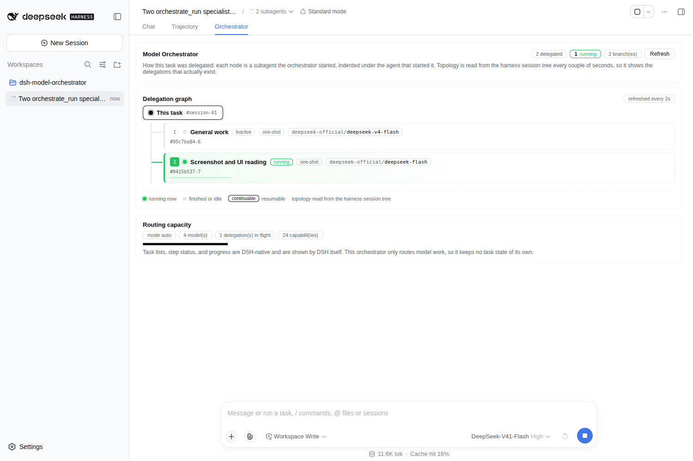

# dsh-model-orchestrator

[English](README.md) | 中文

**适用于 DeepSeek Harness 的通用模型编排器。** 它会发现正在运行的 harness 实际拥有哪些模型，推断每个模型有哪些证据表明的强项，并把每个工作单元路由到当下最合适的那一个——你无需再决定哪个任务该交给哪个模型。

它在自己的选择逻辑里**不指名任何模型、provider 或厂商**，也不针对任何特定业务领域。

---

## 它做什么

| 关注点 | 处理方式 |
|---|---|
| **模型发现** | 在激活时、适配器拓扑变化时、距上次读取最多 5 分钟时，以及按需 —— 面板的**刷新模型池**、`orchestrate_models { refresh: true }`、或 `GET /state?force=1` —— 读取实时 LLM 注册表。provider 的模型列表可能是一次网络往返，因此周期性重读是**惰性**的：只在下次真正需要模型池时发生，且失败时保留已有的模型池。模型池从不硬编码，也从不持久化。 |
| **能力画像** | 依据宿主的权威事实（输入模态、上下文窗口、暴露的推理档位）加上 provider 自己声明的描述，为每个模型建立画像。不臆造任何内容。 |
| **任务匹配** | 把任务转成一组需求，再用确定性方式让每个实时模型对其打分。无法被证据支持的硬性需求会**拒绝**该模型，而不是悄悄降级。 |
| **开放的能力体系** | 能力是通用描述符，不是"领域→模型"的映射表。无法识别的领域会从任务自身的词汇中生成**新的**描述符并持久化，让分类体系真正生长。 |
| **两种模式** | **Auto** 推断任务需要什么。**Guided** 用你为本次会话选定的能力领域为匹配提供种子。 |
| **编排** | 简单工作直接执行。聚焦的工作交给一个专家子代理。复杂的多领域工作会跨多个子代理编排，每个专家的结果都会返回给调用方代理。 |
| **Captain** | captain 是一个**角色**，不是与某个模型的绑定：它是任务的所有者，负责理解、拆解、派发、汇总、验证和收尾。它的路由由匹配器从实时模型池中选出。 |
| **UI** | 一个 `Model Orchestrator` 设置页，以及一个与 `Chat`、`Trajectory` 并列的「编排看板」，展示本会话的派发关系。默认自动化；一切皆可调整。 |
| **持久化** | 偏好设置、学到的能力描述符、按路由的校准值。**绝不持久化模型池。** |
| **兼容性** | 面对不支持的宿主时拒绝激活，并给出精确原因。没有静默降级。 |

## 它是调度器，不是任务管理器

编排器是在正常任务执行**内部**被调用的。它不取代、不镜像，也不与 DSH 原生的任务处理竞争：

| 关注点 | 归属 |
|---|---|
| 任务列表、计划、步骤、步骤状态 | **DSH** —— 编排器不注册任何任务工具 |
| 进度与进度展示 | **DSH** —— 编排器不渲染任何进度界面，也不发出任何事件 |
| 会话记录 | **DSH** —— 编排器不追加任何自定义会话事件 |
| 子代理可见性 | **DSH** —— 被派发的子代理就是常规视图里的普通 DSH 子代理 |
| 已完成工作的记录 | **DSH** 会话日志 —— 编排器不保留运行历史 |
| 哪个模型执行某个工作单元 | **编排器** |
| 一个任务需要一个还是多个专家 | **编排器** |

因此：`todo_write`、计划模式、步骤跟踪和进度渲染全都照常工作，与没有这个插件时完全一样。专家的回答以 `orchestrate_*` 调用的工具结果返回，代理照常写出最终答案。

插件唯一保留的实时簿记，是一组用于在途派发的 abort controller，这样插件重载时会中止子代理，而不是把它们变成孤儿。它不可查询，也绝不作为任务状态暴露出来。

## 为什么通过子代理来路由

harness 只提供一个受支持的、用于选定模型的接缝：**子**代理上的 `agentOptions`（`ctx.subagents.start`）。代理自身的路由在创建时就固定了，运行中的会话也没有逐轮改换目标的钩子。

所以编排器顺着这条接缝工作，而不是与它对抗：

1. 你所在会话的代理仍是面向用户的界面，也是 **captain**。
2. 插件为每个**工作单元**选定一条路由，并在该路由上生成一个子代理。
3. 专家的结果作为工具结果返回给 captain。
4. **由 captain 撰写最终答案** —— 编排器从不与用户对话。

## 安装

```sh
dsh plugin --profile <name> add github:Meaple-SFKY/dsh-model-orchestrator
```

或者从本地检出安装：

```sh
dsh plugin --profile web add /path/to/dsh-model-orchestrator
```

等本包发布到 npm 之后，上面这条可以简写为：

```sh
dsh plugin --profile <name> add dsh-model-orchestrator
```

说清楚原因，免得有人按错误前提做规划：本包**目前不在 npm 上** —— npm 现在要求发布者具备 2FA 或一个带 bypass-2FA 的 granular token，而本账号未开启 2FA，且 TOTP 已无法再注册。从 GitHub 安装不需要这些，社区注册表里约一半的插件也正是这样安装的。详见 [`docs/marketplace-submission.md`](docs/marketplace-submission.md)。

这个 bundle patch 会向该 profile 的 host composition 挂载一行，把 `orchestrate_*` 工具注册进共享工具注册表，向系统提示词贡献一个路由策略小节，并提供控制面板路由。安装后请重启该 profile，让宿主加载新的 bundle。

**先核对宿主版本范围。** 本版本声明 `engines.dsh = "0.1.5-rc.1"`，面对其他版本会**拒绝激活**并给出原因与恢复方式。安装前（或在 CI 中）可用这条命令核对：

```sh
node scripts/check-compat.mjs
```

在一个没有 DSH 可核对的检出里 —— 刚克隆下来，或任何 CI runner —— 它会**如实说明**并以 0 退出，而不是报一个它从未得出的"不兼容"结论；同时仍会校验不需要宿主的那部分：声明的版本范围、`dsh.engines.dsh` 的镜像、peer 声明，以及 `compatibility.json`。若你希望"找不到宿主"就判失败（例如发布闸门），加 `--strict`。

**它不发布任何服务**，因此不需要 `isolate` realm，只消费宿主能力（`llm`、`subagents`、`tools`、`systemPrompt`）。

## 使用

无需配置。提个需求，代理就会路由它：

> *"重构这个解析器，然后跑基准测试，最后把改动写出来。"*

你也可以显式引导它：

- **`/model-orchestrator <task>`** —— 无论代理本来会怎么决定，都把这一个任务交给编排器路由。见下文。
- **Settings → Model Orchestrator** —— 模式、能力领域、成本偏好、并行度、路由允许/拒绝列表、实时模型池、路由预览、能力分工。

### `/model-orchestrator` 命令

自动路由是默认行为，但没有任何东西*强制*调用方模型去路由，而不是自己生成子代理——而且曾观察到一次真实会话通过原生 `subagent` 工具派发了四个异质的研究单元，让每个子代理都落在部署唯一的默认模型上。这个命令正是为这种情况准备的显式开关：

```
/model-orchestrator 分析这个季度的销售数据并写成一份给管理层看的总结报告，包含趋势图表和三条行动建议
/model-orchestrator status
```

handler 运行时**命令行不会到达模型**（这是宿主的命令契约），所以该命令会自己把任务作为一条普通用户消息投递出去，并附带指令：调用 `orchestrate_run`，并在各单元性质不同时按单元指定路由。之后 captain 照常持有结果。

诚实说明其边界：这让意图变得显式、投递可靠，但路由仍然由代理执行——该命令不会绕过 captain，也不会让编排变成自动行为。自动仍是默认；这个命令用于你希望它被保证执行的时候。`recordInput: false` 避免任务被记录两次，而且只有当部署挂载了 `commands` 服务时，该命令才会被注册。

### 工具

| 工具 | 用途 |
|---|---|
| `orchestrate_run` | 分析、匹配、派发每个单元，并返回全部结果。主入口。 |
| `orchestrate_dispatch` | 把一个自包含单元派发给一个模型。更便宜，也更可预测。 |
| `orchestrate_plan` | 展示路由决策，但**不**执行它。 |
| `orchestrate_models` | 当前真实存在的模型，以及每个画像背后的证据。 |
| `orchestrate_capabilities` | 能力词汇表，包括已学到的内容。 |
| `orchestrate_configure` | 修改偏好设置。 |
| `orchestrate_status` | 当前模式、模型池、映射关系、分工表与研究到的公开事实，以及哪些 cue 组仍是内置的。 |

## 模型池里有哪些模型

发现过程读取 LLM 注册表，它列出每个已注册适配器所广告的全部模型。这**并不**等于某个部署打算让你使用的那一组：挂了两个 provider 的 profile 常常把同一个底层模型广告两次，而一个 provider 广告的模型也可能多于用户启用的数量。

所以模型池由两层依次收窄：

1. **部署的子代理路由策略** —— `subagentModelSelection.current()`，也就是 Settings 页面在子代理模型选择处展示的那些确切路由。由于这个插件运行的每个模型都是一条子代理路由，这就是权威答案。
2. **你自己的路由偏好** —— `orchestrate_configure` 的 `allowedRoutes` / `deniedRoutes`，叠加在其上。

让它保持安全的规则：

- 只有当该服务存在、已启用、且至少指定了一条路由时，策略才会约束模型池。策略缺失、被禁用或为空，意味着部署没有表达偏好，发现结果照旧成立——过滤到空会静默地禁用路由。
- 路由按 `provider/model` **精确**匹配。两个 provider 暴露同一个模型 id 时，它们是不同的模型，除非策略排除其中一个，否则两者都保留；id 从不做去重，因为那会丢弃一条合法路由。
- 当策略会导致没有任何可路由项时，这会作为问题上报，而不是显示成一个空模型池。

面板会说明是哪一层收窄了模型池，因此更短的列表读起来是一个决策，而不是故障：

```
Showing the 7 route(s) this deployment offers for subagents;
4 advertised route(s) are not selectable.
```

### 不暴露推理档位的 provider

并非每个 provider 都提供一个可选的档位。DSH 以三种状态报告推理能力，模型池会显示某条路由处于哪一种：

| 状态 | 含义 | 模型池显示什么 |
|---|---|---|
| `adjustable` | provider 暴露档位（`low`、`high`、……） | 一个选择器，其选项就是它报告的档位 |
| `automatic` | 模型会推理，由 provider 决定深度 | **automatic** —— 没有选择器，因为没有什么可选 |
| `none` | 未报告任何推理信息 | 一个短横线 |

处于 `automatic` 状态的路由默认**按原样**使用：不发送任何档位，于是 provider 做的正是它本来会做的事。如果你知道自己的 provider 接受一个它没有列出的档位，你仍然可以设置——`orchestrate_configure { reasoningEffort: { "<route>": "high" } }`——它会被接受、被发送，并在模型池中标记为 **manual**。没有任何东西能验证它，所以 provider 拒绝的档位会让那次派发以适配器自己的错误失败；这就是不去静默忽略你所提要求的代价。完全不报告推理的路由无法被指定档位，而列出了档位的路由则保持严格规则：一个已不在其列表上的 id 属于过期条目，会被忽略。

这一区分在路由中很重要，不只是面板里。需要推理的能力同时接受 `adjustable` 和 `automatic`；而一个指名档位的需求（例如"必须暴露 high"）需要 `adjustable`，因为一个无法被选中的档位满足不了它。为一条不报告档位的路由设置档位，会在设置时被拒绝，若它过后过期则被忽略——发送不受支持的档位会让子代理直接失败。

### 按路由设置推理档位

模型池的 **Reasoning** 列是一个选择器，不是标签。它的选项是宿主为该路由实际报告的档位（`reasoning.efforts`），外加 **default**——意为"让模型自行解析档位"，并在宿主报告时显示它是哪一个（`reasoning.defaultEffort`）。该选择按 `provider/model` 存储，并在编排器每次向该路由派发时作为 `agentOptions.reasoningEffort` 生效，因此 captain 会按你设置的档位派发。

让它保持诚实的规则：

- 路由未广告的档位**在设置时被拒绝**，若它**过期则被忽略**（适配器变更）。发送不受支持的档位会让子代理直接以 `UNSUPPORTED_REASONING_EFFORT` 失败，因此过期偏好会退化为模型默认值——而且模型池会说明这一点，而不是把它显示得像是生效了。
- 不广告任何档位的路由不会得到选择器。
- 调用方模型为某个单元声明的档位优先于已存储的偏好：读任务的模型才是那个单元更好的判断者。但若目标路由无法表达这个档位，它会被**丢弃**并在该单元结果里以 `effortUnavailable` 报出，而不是让整个单元失败。已存储的偏好、调用方逐单元的声明、能力描述符声明的档位，三者都会被按目标路由校验——路由没有广告的档位一律不发。
- 只有档位可配置。这个插件不发明档位，并且在选择逻辑中依然不指名任何模型。

同一个偏好也可以从工具界面设置，供被要求配置它的代理使用：

```
orchestrate_configure { reasoningEffort: { "commandcode/xai/grok-4.6": "high" } }
```

### 模型池的各列

| 列 | 来源 |
|---|---|
| **Route** | 部署自己的 `provider/model` 字符串 |
| **Public model** | 来自 Sync。同步前为空白；当研究无法把该路由对应到一个已发布的模型时，明确标记为*未确认* |
| **Cost ($/M tok)** | 来自 Sync：已发布的每百万 token 标价，并带一根**相对于本模型池中**最贵路由的条形——单看价格回答不了"这贵不贵" |
| **Context**、**Image** | 由宿主测量 |
| **Reasoning** | provider 列出档位时是选择器，只推理而不列档位时是 `automatic`，未报告时为短横线 |

模型 **tier** 列已移除：`deep` / `balanced` / `fast` 是这个插件自己的词汇，而它旁边那些列——上下文、成本——才是它当时在概括的实测输入。

### 能力分工 —— 你固定下来的分工

如果你想要一种特定的分工，而不是按任务逐个判断——*视觉交给一个模型，数学交给另一个，架构交给贵的那一个但实现交给便宜的*——在 **Settings → Model Orchestrator → Capability assignments** 里设置一次，或者用工具设置：

```
orchestrate_configure { capabilityAssignments: {
  "multimodal.vision":       { models: ["gemini-3.8-flash"] },
  "reasoning.mathematics":   { models: ["Qwen 3.8 Max 0902"] },
  "software.architecture":   { models: ["gpt-5.6-sol"] },
  "software.implementation": { models: ["deepseek-v4.1-flash"] },
  "web.information":         { models: ["grok-4.6"] },
  "long.context":            { models: ["Kimi K3"] }
} }
```

条目的键是**一个能力 id 或整个能力组**，值是一个**有序的模型身份列表**。模型以身份存储，而不是路由，因此这张表比模型池活得久：

| 模型池的变化 | 由什么吸收 |
|---|---|
| 模型迁到另一个 provider，或它的路由被改写 | 身份匹配——上表中的行写的是 `gemini-3.8-flash`，而不是某条路由 |
| 发布了新版本（`5.6 → 5.7`） | 每条目上的 **follow the family** 开关，默认关闭：版本号变化通常是同一个模型，但不总是 |
| 模型离开了模型池 | 该条目自我报告为**未解析**；路由会落到下一个条目，再到实测排名 |
| 出现了没有被任何条目提到的模型 | 上报为**未分配的实时路由**——这是留给你做的决定，而不是表格悄悄替你做的决定 |

有两件事它刻意不是：

- **它不是一把锁。** 表格提供偏好顺序；匹配器仍会重排合格候选，仍会强制执行硬性需求和部署的路由策略。表格条目永远无法复活被它们排除掉的路由。
- **它不是关于某个单元的最终裁决。** 调用方模型仍可以用 `analysis.unitModelPreference` 在单个单元上压过它，因为那才是关于该单元更具体的陈述。完整的阶梯是：调用方模型的按单元选择 → 这张表 → 调用方模型的任务级偏好 → 实测排名。

  这两个偏好都必须写在 **`analysis` 内部**（任务级用 `modelPreference`，单个单元用 `unitModelPreference`）。若被放到调用的**顶层**，它会被折进 analysis 并回报为 `foldedIntoAnalysis` —— 因为这个错误曾让一个七单元的研究计划**静默地**全部落到同一个模型上；而其他任何工具不认识的参数会以 `unusedArguments` 报回，而不是被丢弃。

同一个 cluster 内的能力在分工不同时会被拆成独立单元。这正是"架构给 GPT、实现给 DeepSeek"能成真的原因：两者都位于 `software` cluster，如果不拆，它们会合并成一个单元、落在同一个模型上，表格就会静默地什么都不做。

插件在选择逻辑中依然不指名任何模型——这张表是你的。身份匹配只回答*"这是不是仍然是同一个模型"*；它从不判断哪个模型更擅长什么。

### 两个面板如何关联

它们并排放在一起，回答的是**不同的问题**，这也是它们不可能互相矛盾的原因：

| 面板 | 问题 | 控制什么 |
|---|---|---|
| **能力领域**（Guided） | *本次会话涉及哪些类型的工作？* | 需求集合：它以权重 0.7 为某个能力播种，因此会产出一个光靠任务文本不会出现的单元 |
| **能力分工** | *每种工作由谁来做？* | 单元所匹配路由的偏好顺序，以及同一 cluster 内的两个能力是否拆成独立单元 |

所以组合关系是：**领域决定存在什么，分工决定谁来做。** 只有两者都指名同一个能力时才会重叠，而那种情况下也没有什么需要调和的——领域让需求存在，分工为它选定路由。

有两条规则维持这一点，它们都是新近才强制执行的，此前都被破坏了：

- **领域只在 Guided 模式下生效。** 它们过去无论什么模式都会播种，于是在 Auto 打开时仍被选中的领域会静默地持续影响路由——而面板却说它们在 Guided 下生效。Auto 的意思是"读每个任务并自行判断"。你保持选中的领域是为 Guided 回来时留着的，不会被应用。
- **调用方自己的需求不再丢弃它们。** 此前只要调用方声明了任何需求，intake 就整体返回调用方的分析，于是一个有问必答的调用方会静默覆盖用户自己的会话设置。现在它们会被合并：对两者都指名的能力，调用方胜出（它是关于*这个任务*更具体的陈述）；调用方没有指名的领域会被**加上**，因为别的什么都不会把它带出来，而用户要求过它。结果里会报告 `source: "model+guided"`。

有一个后果值得知道：分工**只对成为需求的能力生效**。它是路由策略，不是触发器——指派 `web.information` 并不会让一个任务涉及 web。能力领域*可以*充当那个触发器，这是两个面板组合出彼此单独都做不到的效果的唯一方式。

## 匹配如何工作
```
score(model, task) = geometric_mean( satisfaction(requirementᵢ, model) ^ weightᵢ ) × confidence
                     − cost_shaping
```

- **合取，而非平均。** 一个做不了某项必需事情的模型，不会因为擅长相邻的事而被救回，因此每个需求的满足度是相乘而不是取平均。
- **硬性需求会拒绝。** 模态、上下文下限和推理可用性在打分*之前*就被检查。未知模态被当作*未知*，绝不当作有能力。
- **能力水平是测出来的，不是从文字推断的。** 诸如 `depth.difficult` 这样的深度需求，会依据宿主测量到的事实（暴露的推理档位、上下文窗口）来解析。这正是路由能对一个从未有模型自称覆盖过的领域也生效的原因。
- **成本塑形永不覆盖需求。** 它只用于打破平局。

### 证据层级

每个画像都会记录其证据来自何处：

| 来源 | 含义 |
|---|---|
| `metadata` | 宿主的权威事实：模态、上下文窗口、输出上限、推理档位。 |
| `declared` | provider 自己的模型名和描述。软证据。 |
| `calibrated` | 模型对编排器自身自探针的回答。 |

匹配器把实测事实的权重置于推断之上，并报告每个候选的证据，使决策可被审计。

## 兼容性与版本

宿主范围在生态读取的**两处**都有声明：

```json
{
  "engines": { "dsh": "0.1.5-rc.1" },
  "dsh": { "engines": { "dsh": "0.1.5-rc.1" } }
}
```

`engines.dsh` 是权威；`dsh.engines.dsh` 为市场上的发现镜像它。`peerDependencies` 声明实际导入的 `@deepseek-ai/*` 包，并被独立检查。

**每次激活时，在注册任何东西之前**，插件都会证明三件事：

1. 声明的范围接受正在运行的 DSH 版本（从已安装的树中解析，并用宿主自己的 `semver` 求值）。
2. 每个必需的服务**及方法**都按名称存在。
3. 至少注册了一条带有可用 id 的 provider **路由**——刻意不要求能响应模型列表，因为那可能是一次网络往返（见*性能*一节）。

任何一项检查失败，插件就**不**注册任何工具、提示词小节或路由，记录一个精确原因（指名该需求与发现到的东西），并抛出，让该行大声失败。它绝不静默降级。因为这道门在每次激活时都会运行，升级进入不支持的宿主会被拒绝，而不是被运行。

随时可以运行独立检查：

```sh
node scripts/check-compat.mjs
```

## 环境要求

- **DSH** `0.1.5-rc.1`（精确锁定；见 `compatibility.json`）
- **Node.js** `^22.19.0 || >=24`
- 一个挂载了 `llm`、`subagents`、`tools` 和 `systemPrompt` 的宿主 composition —— 随附的 `web` 和 `headless` profile 四者齐全。
- 至少一个已注册、能列出模型的 LLM provider。

客户端面板还额外需要一个 web 服务器；没有它时工具照常工作，只有面板不可用。

## 运维

### 禁用与移除

harness 设置里**没有通用的启用/禁用按钮**：Plugins 设置页只配置插件，不停用它们。关掉一个插件要通过 **loader row**，这是官方机制，不需要插件做任何代码改动。

**禁用**：向该 profile 的用户 patch 层加一行：

```sh
dsh plugin --profile <name> add dsh-model-orchestrator   # if not installed yet

cat >> "$DSH_HOME/profiles/<name>/cordis.patch.yml" <<'YAML'
- id: model-orchestrator
  disabled: true
YAML
```

由于 profile 的 `patchReload` 是 `live`，改动会在一秒左右内热应用——无需重启——而 loader 每次启动都会重新应用该文件，因此这个选择能跨重启保留。`disabled: false` 会重新强制启用该行，覆盖更底层把它禁用的设置。

禁用期间 loader 从不调用插件的 `apply`，因此**不会注册任何工具、提示词小节或控制路由**。重新启用会从实时状态重新注册它们全部；插件不持有任何可能变陈旧的任务状态，其 teardown 会中止任何仍在途的派发。

**完全移除**：

```sh
dsh plugin --profile <name> remove dsh-model-orchestrator
```

移除会在下次启动时撤回全部工具、提示词小节和控制路由；profile 中其他内容不受影响。由于插件不注册服务、不持有任务状态，移除不会让任何会话搁浅。

> 社区市场插件只管理它自己安装的东西，所以用 `dsh plugin add` 添加的插件
> 不会出现在那里供你切换。请使用上面的 patch 行。

### 宿主不受支持时

一个 `engines.dsh` 不接受正在运行的 DSH 的构建会**拒绝激活**。composition 行会大声失败，给出需求、发现到的版本，以及一行恢复建议：

```
dsh-model-orchestrator 0.0.1: incompatible host — the plugin is disabled
  1. DSH 0.1.5-rc.1 does not satisfy the declared range "0.9.9-rc.1" (>= 0.9.9-rc.1)
  Required host range: dsh 0.9.9-rc.1  (running: 0.1.5-rc.1)
  Recovery: remove the plugin from this profile with `dsh plugin --profile <name> remove dsh-model-orchestrator`, or install a build whose "engines.dsh" admits this host.
```

这是刻意的：它什么都不注册，也绝不静默降级。在安装前、或在 CI 中检查一个构建：

```sh
node scripts/check-compat.mjs
```

### 升级

这道门在**每次**激活时都会运行，而不只是安装时，因此升级进入不兼容的宿主会被拒绝，而不是被运行。偏好设置、学到的能力描述符和校准值存放在 `$DSH_HOME/orchestrator/state.json`，能跨升级保留；离开模型池的路由，其校准值会被自动清理。

### 界面

**Settings → Model Orchestrator** 是完整页面：模式、能力领域、带每个评估依据的实时模型池、偏好设置，以及路由预览。

**能力领域**属于 Guided 模式，页面也这么说明：在 Auto 下该面板是折叠的，并有一行说明它在哪里；选择 Guided 时，它以短促的滑动淡入展开，而不是瞬间替换布局。过渡约 340 ms，`prefers-reduced-motion: reduce` 会完全关掉它，文案称呼模式的方式与按钮一致（`自动` / `引导`，绝不混用译名与英文模式名）。

**Orchestrator** 是一个 Conversation 视图，与 `Chat` 和 `Trajectory` 同级：


 它是你正在查看的会话的面板，由三部分组成：

- **派发图（Delegation graph）** —— 本会话的每个子代理，缩进在启动它的代理之下，并显示其模式（`one-shot` / `continuable`）和实时活动。编排器路由的派发会显示它选中的模型；DSH 自己启动的则标记为**原生派发**，因为编排器从未为它选择模型。拓扑读自 harness 自己的持久会话树（`ctx.subagents.listDescendants`），每隔几秒刷新，因此它显示的是真实存在的派发，而不是一份镜像副本。路由来自派发自身的 label——宿主的列表不报告模型——所以 `orchestrate_run` 和 `orchestrate_dispatch` 都写 `<name> via <route>`。
- **统计（Stats）** —— 有多少个派发、多少正在运行、多少分支。
- **路由容量（Routing capacity）** —— 当前模式、实时模型池大小、在途派发数和能力数量。

输入框上方刻意没有常驻条：面板才是检查派发工作的地方，再加一条既会与它重复，也会挤占输入框。

两者都遵循 harness 的语言设置：每个面向用户的字符串都位于插件的 `modelOrchestrator` locale 命名空间中（`lib/locales.js`，并在自包含的客户端 bundle 内镜像），覆盖两个随附 locale。**模型**读取的字符串——工具描述、参数 schema、路由提示词小节、persona——刻意保持英文，不跟随 UI 语言。

能力名称沿用同样的划分：分类体系的 label 面向模型，保持英文，因为它们会进入子代理提示词和派发 label，而面板通过自己的 `capability.label.<id>` 条目翻译它们——于是「能力领域」以中文呈现，而代理收到的仍是 `Testing and verification`。尚未有条目的已学能力会回退到它的分类体系 label。

术语政策：通用和技术术语保持不译。`host` / `requires` 版本标签、`provider`、`Route`、诸如 `workflowEngine` 这样的部署 id、模型名与路由名、reasoning-effort id，以及像 `0.1.5-rc.1` 这样的版本字符串，都是数据或共享标识符，因此在每种语言中都原样出现。只有解释性文字才被翻译。

两者都由宿主通过同源路由提供：`state`、`configure`、`plan`、`tree`（看板的派发关系图）与 `sync`（研究扫描）。浏览器那一半无法自己枚举模型——LLM 列表接口只存在于宿主——因此面板从宿主读取真实模型池，从不猜测。

## 多单元计划如何执行

单元**默认并行**。各部分相互独立的计划（这是常见情形）按其 `maxParallel` 设置分波跑完，单元之间互不等待。

`chain: true` 则把计划变成**流水线**：每个单元收到前序单元的发现，这正是真正的先后序列（"先研究、再评审、后总结"）所需要的。它以前是**自动**的，而那是错在相反的方向：一个含八项需求的研究任务被串成七个顺序代理，每个都自己做检索、每个都要等前面全部完成 —— 结果撞上调用方 30 分钟的工具调用上限，返回一个超时错误、**零结果**，因为超时丢的是全部而不是已完成的部分。决定这一点的是代价的不对称：并行单元可能少一点跨单元上下文，而串行一旦超时就全都拿不到。调用方若自己提供 `units`，无论如何都完全掌控依赖图，其 `dependsOn` 永远不会被改写。其中每个单元都可以自带 `route` 来指定路由，也可以不写、由它声明的能力来路由；若指定的路由已不在实时模型池里，会**降级为按能力路由**并以 `routeRequested` 说明它原本要哪一个，而不是让这个单元因为一个过期的名字而丢掉。另外，自带单元的 `prompt` 请写短：本次 run 的 `task` 会被自动加到每个单元的提示里，重复写只会让这个参数大到写错的概率上升。

**一次运行也会自我限时。** `budgetMs`（默认 25 分钟）会在调用方自己的工具调用上限之前中止本次运行，从而返回已完成的单元、把其余标为未完成，并置 `budgetExhausted`。没有它，那个上限就是唯一的限制，代价是整次运行。若你自己的工具调用上限比默认值更短，请传更小的 `budgetMs`。

## 谁来决定用哪个模型

选择是一种分工，因为任何一方都无法独自完成。

**插件**了解部署：它发现实时路由，应用子代理路由策略，强制执行硬性需求（声明的上下文下限、必需的模态），并报告实测事实——上下文窗口、模态、输出预算、推理档位。

**调用方模型**了解模型。某个不透明的路由 id 对应的是视觉强的模型还是数学强的模型，是插件没有、也绝不能臆造的公共知识；部署的别名也不见得匹配任何公开的模型名。

因此 `orchestrate_run` 和 `orchestrate_plan` 接受 `analysis.modelPreference`：调用方模型按最偏好优先的顺序，指名它认为最好的路由，并给出理由。对于各单元需要**不同**模型的计划——视觉单元和数学单元很少想要同一条路由——`analysis.unitModelPreference` 按精确能力 id 或按 cluster 逐个指名它们，对该单元最具体的目标胜出。没有匹配到任何条目的单元保持任务级偏好。规则如下：

| 规则 | 原因 |
|---|---|
| 偏好会**重排**合格候选 | 它是判断，不是约束 |
| 偏好**无法复活被拒绝的路由** | 你的需求始终是权威 |
| **无法识别的名称会被回报** | 绝不静默丢弃 |
| **格式错误的条目会被丢弃** | 不能凭空造出半成品的路由 |
| **没有偏好时，实测排名照旧成立** | 插件单靠自己也能工作 |

同一小节还给出了完整阶梯，从高到低，因为一个看起来被忽略的偏好与一个 bug 别无二致：

| 层级 | 由谁设定 |
|---|---|
| `analysis.unitModelPreference` | 调用方模型，关于**一个单元**——最具体的陈述 |
| **能力分工** | **用户**固定下来的策略，在面板中设置一次 |
| `analysis.modelPreference` | 调用方模型，关于**任务** |
| 实测排名 | 插件，依据宿主事实 |

因此任务级偏好**不会**推翻用户配置的那张表——否则任何爱多说的调用方都会悄悄击败它——而按单元的偏好仍然可以，这就是为单个单元覆盖该表的方式。工具描述会明确告诉调用方模型这一点，使它去求助自己的模型知识，而不是相信一个自己无法解读的路由 id，也使它明白自己站在哪一层上。

### 判断权属于模型

任何**关于任务的判断**都该由调用方模型来做。插件自己的线索列表是**回退**，用于没有模型提供分析的时候——绝不是可以推翻模型的权威，也绝不是唯一能被理解的措辞。

| 插件 | 模型 |
|---|---|
| 测量事实：上下文窗口、模态、输出预算、推理档位 | 读任务并判断它需要什么 |
| 强制执行路由策略与硬性需求 | 用自己的词汇指名能力 |
| 在没有任何输入时回退到线索列表 | 陈述复杂度和模型偏好 |

具体来说：

- 模型提供的分析**按原样使用**。它的 `complexity` 不再与本地解读做调和——那种调和曾把一个自称 `complex` 的模型降级为本地观察到的 `specialist`，并把一个 `trivial` 的声明提级。
- 回退词汇表位于 `lib/decision-vocabulary.js`，并可通过 `orchestrate_configure` 的 `decisionCues` **替换**，因此运维者永远不会被作者的措辞困住。`orchestrate_status` 会报告哪些分组仍是内置的。
- 回退列表刻意保持精简，并被文档化为提示，因此它们不会被误当成"任务是什么"的定义。

### 插件不会做什么

它不会把两条共享模型名的路由合并。在此处测量的部署中，`deepseek-official/deepseek-flash` 与 `commandcode/deepseek/deepseek-v4.1-flash` 指同一个公开模型，但输出预算相差 4 倍（256k 对 64k），位于不同 provider 之后，计费方式也不同。把它们合并会丢弃真实的、已测量的差异，并破坏路由，而路由需要精确的路由。

它也**不会自己**从网络抓取公开的模型数据。部署中的路由 id 往往根本不是公开模型，而一个从名字猜测它们身份的插件将是在臆造能力，而不是测量能力。它提供的是 Sync：一个由**你**按下的动作，它会研究模型池并展示发现的结果、附上来源，并把无法确认的内容明确保持为未确认。

## 来自网络的模型事实（Sync）

宿主完全不报告定价，这让成本偏好成了一个什么都不做的开关：像这样模型池里的每条路由都测得同一档，于是它所塑造的打破平局处处相同。模型池里的 **Sync** 用公开事实补上了这一点：

- **一条路由是哪个公开模型。** 路由 id 是部署自己的字符串，常常重复发布者（`commandcode` + id `deepseek/deepseek-v4.1-flash`，广告名 `DeepSeek V4.1 Flash (CC)`）。Sync 会解析它，或者报告它无法解析。
- **已发布的标价**，按每百万输入和输出 token 计。
- **公开来源说这个模型擅长什么**，以及这些说法出自哪些 URL。

Sync 是**插件自身**在网络上采取的唯一动作——唯一一个由它选择成本与内容的动作。它刻意不是自动的：激活时或轮询时都不抓取，只有按下按钮才做一次清扫。（harness 自己的模型发现在刷新模型池时确实会与 provider 通话；这就是插件让发现过程不进入启动路径、也绝不在轮询时重跑它的原因。见*性能*。）
在没有 `web` 服务的部署上，Sync 会报告它无法研究，其他一切不受影响——该服务和命令注册表一样是可选的。它通过 harness 自己的 web 服务为每条路由搜索一次网络，然后用一次模型调用把来源归整为事实——模型判断来源，插件决定它被允许看到什么，且不存储验证器无法核查的内容。

| | |
|---|---|
| **未确认就保持未确认** | 研究者无法对应到已发布模型的路由会以未确认存储，绝不给予一个看似合理的名字 |
| **不做估价** | 只有来源明确给出价格时才使用。缺失就是缺失；免费额度不是标价 |
| **来源是记录的一部分** | 每个条目都带有其来源、读取时间，以及是哪条路由做的读取 |
| **它绝不覆盖测量** | 价格只塑造打破平局，且在该 tier proxy 曾用的同一个 0.08 上限内，并相对于*本*模型池中最贵的路由做归一化。硬性需求仍会在查询这一切之前就拒绝 |
| **它始终显示为已研究** | 模型池在每一行上显示它，标记为已研究；画像自身的证据仍读作 `metadata`，因此来自网络的内容不会被悄悄混入实测事实 |

`preferCheaper` 在有研究价格的路由上使用该价格，在没有的上面使用 tier proxy，因此启用研究会改变成本是*从*什么测量出来的，绝不改变它被允许有多大影响。研究条目按模型身份作键，因此 provider 迁移不会让它们变成孤儿——而一个不再能解析的条目，正是模型池那一行所显示的漂移。

## 布局

面板渲染为一个**居中的、受限宽度的列**，与随附的 Chat 和 Trajectory 视图的布局方式一致。这不是装饰：对话外壳对 transcript 的宽度手柄采用*绝对*定位，位置相对内容列偏移，因此一个满幅绘制的视图会把内容直接画到那些手柄下面。在一次真实会话中测得：面板列横跨 x 498–1272，而手柄位于 x 436 和 x 1304——避开了内容，这正是它们该在的位置。

面板采用外壳自己的内容宽度，因此拖动 transcript 宽度手柄也会改变它的大小——与 Chat 页面上输入框保持的行为一致。宽度是一条 CSS 链（外壳的变量，然后是它的一个被观察到的副本，再是外壳的 920px 上限）放在带下限的 clamp 里，因此一个未解析的变量不会让视图塌掉。

## 性能

插件不能让 harness 感觉变慢。有两条规则强制这一点，二者都是通过给真实 profile 启动计时而发现的回归：

1. **激活时不进行任何网络 I/O。** 兼容性门最初用 `listModels()` 探测每个 provider，以证明模型池可用。provider 的模型列表可能是一次实时 HTTP 请求——内置的第三方 provider 每次调用都会重新抓取其目录，带 10s 超时，只在失败时回退到磁盘——于是这道门把每次启动变成了多秒等待。现在这道门只检查有一个 provider **路由**已注册；provider 是否响应是运行时状况，作为模型池问题上报。实测效果：profile 启动从 **6.7s 回到 3.9s**，与无插件基线相差 3ms 以内。
2. **轮询绝不重读 provider。** 面板轮询 `/state`，而发现过程原本每次读取都会重跑。现在 `/state` 提供它已有的模型池；只有显式 `?force=1`（面板的 Refresh 按钮）或 harness 报告适配器变化时才会重新发现。`/plan` 也不再发现——预览一条路由绝不能打到 provider。

发现过程仍在激活时立即开始；只是不被 await，因此模型池相关的任何事都不会阻塞启动。第一次面板读取会等待那次在途的发现，而不是画出一个空模型池。

## 中断与重启

插件不持有任何持久任务状态，因此中断不会让它卡住。

**如果你在编排中途取消会话**，工具的信号会中止并到达子代理；子代理的结果被拒绝，这在运行中被记录为一个**失败单元**——永不挂起，永不出现未处理的 rejection，也永不留下静默的空缺。每个生成的子代理在每条路径上都恰好被销毁一次。

**如果进程被杀**（`kill -9`、崩溃、断电），内存里的东西都无关紧要了：

| 重启时 | 行为 |
|---|---|
| 偏好设置、模式、Guided 领域 | 从 `$DSH_HOME/orchestrator/state.json` 恢复 |
| 学到的能力描述符 | 恢复，并可再次使用 |
| 按路由的校准值 | 恢复；模型已离开模型池的条目会被清理 |
| 模型池 | 从实时注册表**重新发现**——从不恢复，因此不可能陈旧 |
| 路由注册 | 在激活时重新挂载 |
| 被截断或损坏的状态文件 | 回到默认值并报告原因，下一次写入会修复它 |
| 来自**更新**插件版本的状态文件 | 拒绝且不覆盖，因此降级不会损坏它 |

写入是原子的（临时文件，然后重命名），因此在写入过程中被杀只会留下旧文件或新文件——没有部分状态需要恢复。`test/lifecycle.test.js` 固定了以上全部行为。

### 已知的原生注意点

一条来自测试的观察，为完整起见而报告，而非作为插件缺陷：在一次运行中，对 `dsh --profile headless` 进程执行 `kill -9` 后留下了一个存活的 `dsh` 子进程（被 init 收养，仍持有一个网络套接字）。我**没能**在其后两次受控尝试中复现它——一次没有任何子代理，一次有编排器生成的子代理——而进程内子代理不可能比其父进程活得更久，所以那个子进程不是被派发的代理。如果你在杀掉会话后看到残留的 `dsh`，用下面的命令检查：

```sh
pgrep -fa 'dsh --profile'
```

## 开发

```sh
node --test "test/*.test.js"   # 293 tests, no host required
node scripts/check-compat.mjs  # host compatibility report
```

测试套件无需真实 harness 即可运行。在真实宿主契约重要的地方——`defineTool` schema 编译器与无损 JSON 输出验证器、客户端模块加载器、版本解析——测试会解析**已安装**的宿主包并演练真实的东西，把插件实体化在一个指向宿主 `node_modules` 的符号链接旁边。

其中两项检查之所以存在，是因为一次真实启动发现了形状测试无法发现的缺陷：每个工具都缺少 `output.render`，以及一个被宿主的无损 JSON 验证器拒绝的 `undefined` 属性（`JSON.stringify` 会悄悄隐藏它）。两者现在都被固定住了，另有一条守卫确保插件永不长出任务或进度界面。

## 布局

```
lib/
  index.js          plugin entry: gate, wiring, pool, tools, prompt, routes
  compatibility.js  activation gate and host version resolution
  taxonomy.js       open, domain-agnostic capability descriptors
  discovery.js      live pool discovery and capability profiling
  matching.js       task analysis, scoring, and route selection
  engine.js         orchestration tiers, delegation, aggregation
  persistence.js    atomic state: preferences, descriptors, calibrations, research
  preferences.js    the ONE preference-patch implementation both configure surfaces call
  tools.js          the orchestrate_* model-facing tools
  schemas.js        tool names and parameter specs (host-free, so they are testable)
  locales.js        zh/en dictionaries for the UI (mirrored into the client bundle)
  routes.js         host control routes for the browser panel
  commands.js       the /model-orchestrator human command (host-free, so it is testable)
  reasoning-effort.js  per-route reasoning level: validation and merge, shared by both configure surfaces
  model-research.js    public facts about models: prompt, validation, price lookup
  web-research.js      the two-stage sync: web searches, then one reconciling model call
  sync.js              one research sweep at a time, and its status
  model-identity.js    model identity and family keys: which live route a stored intent means
  assignments.js       the standing division of labour: normalise, resolve, report drift
  agent-tree.js     subagent relationship tree for the board (pure, testable)
  route-policy.js   narrows discovery to the routes the deployment offers
  prompt.js         the routing-policy system prompt section
  client.js         client bundle: settings page + the Orchestrator board
  home.js, util.js  harness-home and value helpers
```

参见 `DESIGN.md` 了解它所依据的、经过验证的宿主契约；`docs/` 中有从已安装的 DSH 树中收集的完整 API 参考。

## 许可

MIT —— 见 `LICENSE`。
